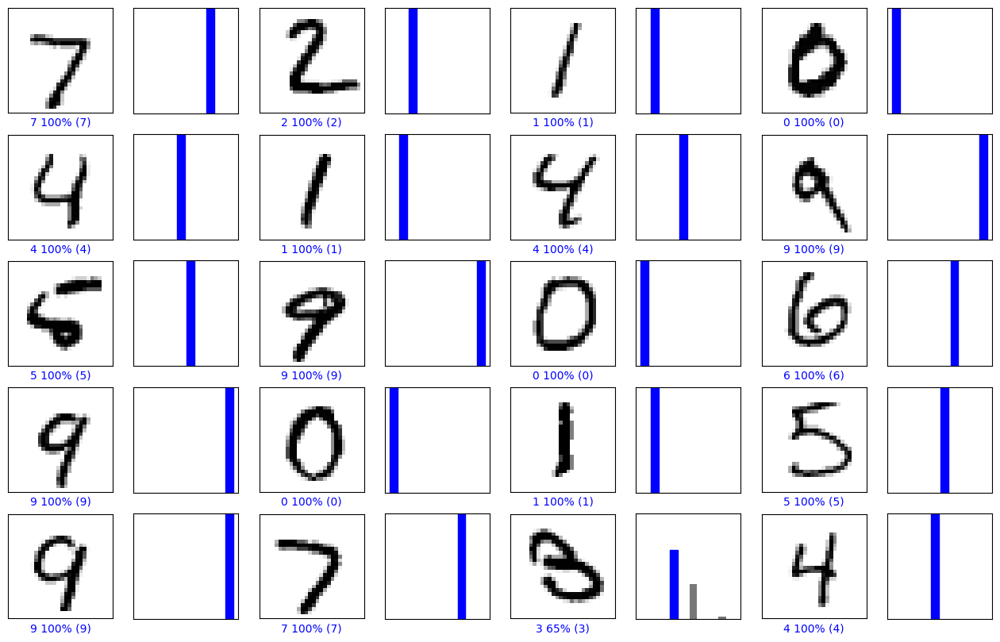
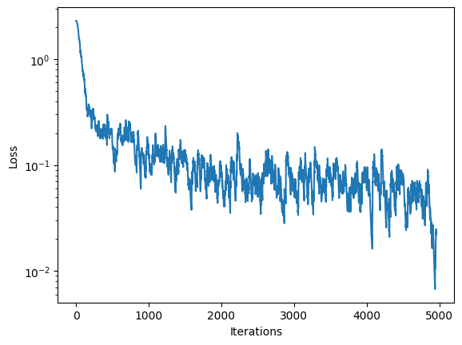
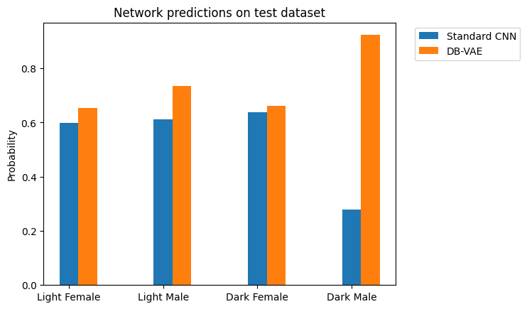

# 6.S191IntroductionToDeepLearningLabsEx
This repository contains solutions to the MIT Introduction to Deep Learning labs.
# Lab 1.
# Music Generation
Below is the graph that shows how increasing number of iterations lowers loss of the model during training phase  

Generated songs  
Song 0:  

[Check Song 0](lab1/assets/generated_song_0.wav) 

Song 1:  

[Check Song 1](lab1/assets/generated_song_1.wav)

# Lab 2.  
# Digit classification based on images from MNIST dataset  

Here is the plot of several images along with their predictions, where correct prediction labels are blue and incorrect prediction labels are grey.

Below is the graph that shows how increasing number of iterations lowers loss of the model during training phase with SGD and GradientTape

# Debiasing model using latent space with learned mean and standard deviation

Bellow are the probabilities of selecting image from each group before debiasing and after  

