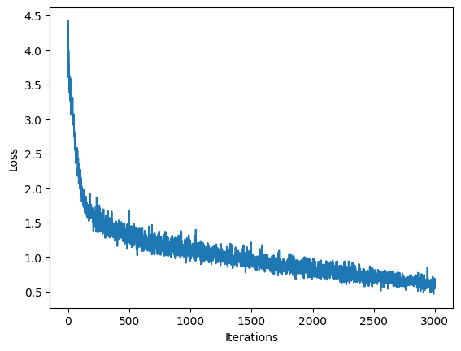

# 6.S191IntroductionToDeepLearningLabsEx
This repository contains solutions to the MIT Introduction to Deep Learning labs.
# Lab 1.
# Music Generation
Below is the graph that shows how increasing number of iterations lowers loss of the model during training phase  

Generated songs  
Song 0:  

[Listen to Song 0](lab1/assets/generated_song_0.wav) 

Song 1:  

[Listen to Song 1](lab1/assets/generated_song_1.wav)
